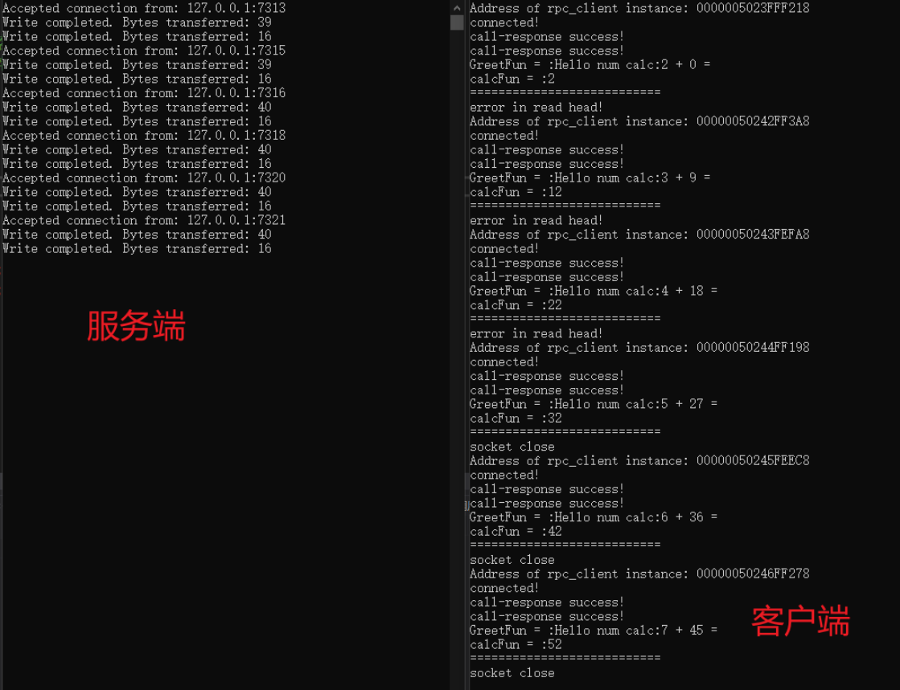

# 基于Modern C++ 和Asio库实现的轻量化RPC服务框架

- （1）下载并配置boost库
- [Boost C++ Libraries](https://www.boost.org/)
- （2）配置msgpack库
- [msgpack/msgpack-c at cpp_master (github.com)](https://github.com/msgpack/msgpack-c/tree/cpp_master)
- 该RPC框架仅依赖Asio库以及Modern c++，支持跨平台；

- 实现效果如下所示
- 